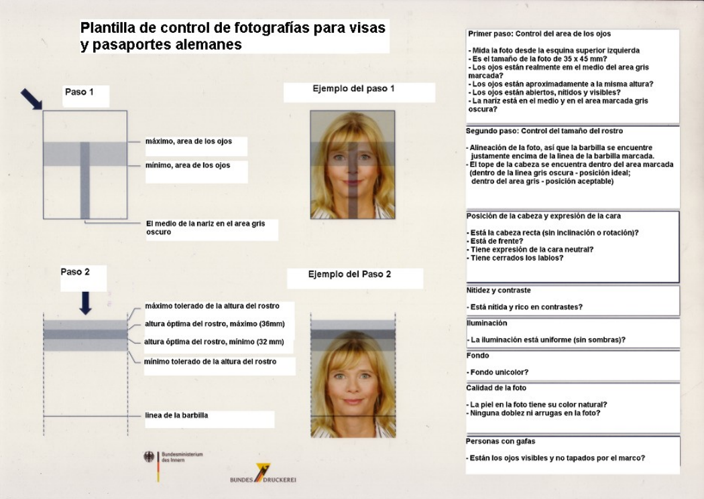

# Visa para Reunificación Familiar
### Proceso, Documentación y Requisitos
###### Noviembre 2024

---

## Objetivo de la Visa
La visa de reunificación familiar permite a cónyuges de personas residentes en Alemania reunirse y vivir con ellos si el cónyuge residirá por al menos un año.

*Requisito clave:* La visa solo se concede tras la aprobación de la autoridad de extranjería en Alemania.

---

## Proceso de Solicitud
1. **Formulario**: Documentación y formulario completos y firmados.
2. **Reservar cita**: Necesaria para iniciar el proceso.
3. **Asistir a cita en la embajada**: Asistir a la cita y presentar documentación.
4. **Tiempo de espera**: Entre 6 y 8 semanas a partir de la entrega de documentos.
5. **Recibir visa en domicilio**: Se entrega en el domicilio indicado en el paquete PakMail.

**Recomendación**: No reservar vuelos antes de recibir la visa.
---

## Documentación Requerida

1. **Fotografía biométrica reciente**
2. **Pasaporte vigente**
3. **Formulario de solicitud**
4. **Formulario de contacto y representación**
5. **Copia de la página de datos del pasaporte**
6. **Copia de identificación oficial del cónyuge**
7. **Carta de invitación del cónyuge en Alemania**
8. **Acta de matrimonio apostillada y traducida al alemán**
9. **Certificado de idioma alemán nivel A1**
10. **Comprobante de seguro médico**
11. **Documentos adicionales según la situación**

---

## 1. Fotografía Biométrica Reciente

- **Formato**: Tamaño pasaporte.
- **Especificaciones**: Debe cumplir con los requisitos biométricos de la embajada.

  

---

## 2. Pasaporte Vigente

- **Requisito**: Mínimo de 1 año de vigencia restante al momento de la solicitud.
- **Páginas en blanco**: Debe contar con al menos 2 páginas en blanco.
  
*Es fundamental que el pasaporte esté en buen estado y no esté próximo a vencer durante el proceso.*

---

## 3. Formulario de Solicitud

- **Formato**: Completo y firmado.
- **Disponible en línea**: Puedes descargar el formulario de la página de la embajada.

---

## 4. Formulario de Contacto y Representación

- **Propósito**: Facilitar el contacto con la embajada y delegar representación si es necesario.
- **Formato**: Debidamente llenado y firmado.

*Asegúrate de incluir los datos completos de contacto para recibir notificaciones oportunas.*

---

## 5. Copia de la Página de Datos del Pasaporte

- **Formato**: Copia simple.
- **Propósito**: Verificar la identidad y nacionalidad del solicitante.

*Incluye una copia legible de la página que contiene tu información personal y fotografía.*

---

## 6. Copia de Identificación Oficial del Cónyuge

- **Formato**: Copia simple del anverso y reverso.
- **Aplicable para**: Personalausweis (ID oficial alemana) o pasaporte extranjero si el cónyuge no es alemán.

---

## 7. Carta de Invitación del Cónyuge en Alemania

- **Contenido**: Debe incluir los datos personales y la dirección del cónyuge en Alemania.
- **Formato**: Informal, pero debe ser clara y precisa.

*Esta carta ayuda a verificar el vínculo entre el solicitante y el cónyuge residente en Alemania.*

---

## 8. Acta de Matrimonio Apostillada y Traducida

- **Requisito**: Actas de matrimonio emitidas en México deben incluir una apostilla.
- **Traducción**: Realizada por un perito traductor al alemán.

*Asegúrate de que tanto el acta como la traducción estén en buen estado y claramente legibles.*

---

## 9. Certificado de Idioma Alemán Nivel A1

Para demostrar competencia básica en el idioma alemán, puedes obtener un certificado de nivel A1 en instituciones acreditadas.

### Instituciones Recomendadas:
1. **Goethe-Institut México**  
   - Sitio web: [https://www.goethe.de/ins/mx/de/index.html](https://www.goethe.de/ins/mx/de/index.html)  
   - **Descripción**: Ofrece cursos y exámenes reconocidos internacionalmente, con diversos niveles de competencia en alemán.

2. **Bezirk**  
   - Sitio web: [https://bezirk.mx/de/](https://bezirk.mx/de/)  
   - **Descripción**: Instituto en México que provee certificaciones de alemán avaladas, incluyendo preparación para los exámenes de nivel A1.

*Elige una institución reconocida para asegurarte de que tu certificado sea válido en Alemania.*

---

## 10. Comprobante de Seguro Médico

- **Cobertura**: Mínimo de 30,000 euros, válida para el Espacio Schengen.
- **Duración**: Al menos 90 días desde la fecha de ingreso o hasta que puedas demostrar cobertura en Alemania.

*Es importante adquirir un seguro médico adecuado antes de viajar.*

---

## 11. Documentos Adicionales según la Situación

- Para **ciudadanos de la UE/EEE**: Certificado de inscripción en la oficina de registro y contrato laboral o comprobante de solvencia económica.
- Para **solicitantes no mexicanos**: Permiso de residencia en México (FM2 o FM3) con copia.

*Verifica tu situación particular para presentar los documentos requeridos.*

---

## Tarifas y Pago
- **Visa para cónyuge ciudadano de la UE**: Gratis.
- **Visa para cónyuge de tercer país**: 75 € (pago en efectivo en pesos mexicanos).

---

## Información de Contacto

**Dirección de la Embajada**  
Horacio 1506, Col. Los Morales Sección Alameda,  
Del. Miguel Hidalgo, 11530 Ciudad de México  

- **Teléfono**: (0052) 55-52 83 22 00 *(no se atienden consultas sobre el estado del trámite de visa)*
- **Correo**: [visa@mexi.diplo.de](mailto:visa@mexi.diplo.de)
- **Sitio Web**: [www.mexiko.diplo.de](http://www.mexiko.diplo.de/)

:::footer
Recuerda presentar todos los documentos en el orden requerido. Solicitudes incompletas pueden ser rechazadas.
:::

---

## Declaración Final

Certifico que he:
- Leído y entendido esta hoja informativa.
- Organizado y completado todos los documentos requeridos en el orden indicado.
- Comprendo que una solicitud incompleta puede resultar en la denegación de mi visa.

---

layout: center
---

# ¡Gracias!
### Preguntas y respuestas
